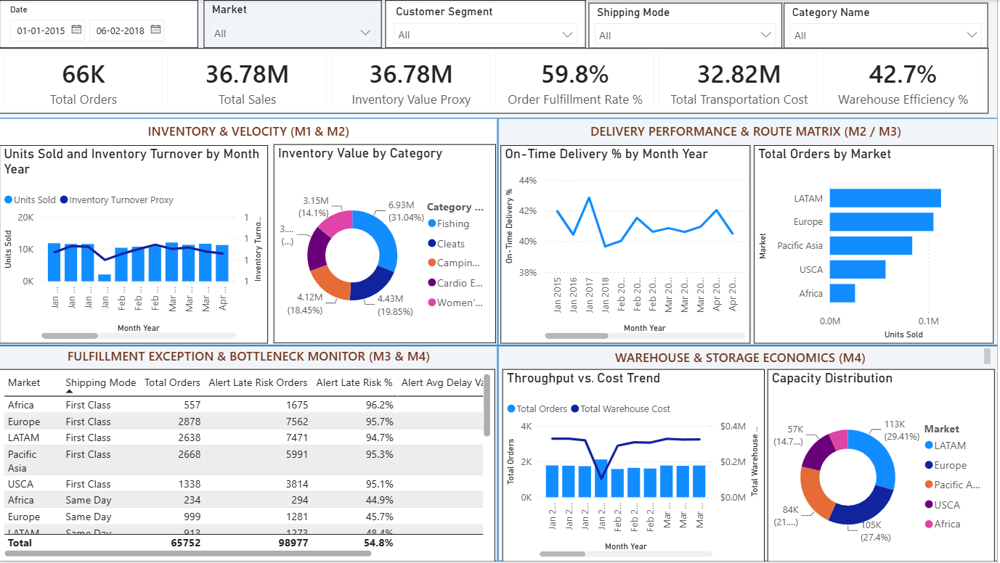

# Supply Chain Visibility System with Optimization Analytics

Interactive Power BI dashboard for end-to-end supply chain performance — sales, inventory, delivery, supplier, transportation and warehouse.

# Dashboard Screenshots

### Star Schema Data Model

### Milestone 1 — Data Modeling & KPI Foundation

### Milestone 2 — Inventory & Delivery Analytics

### Milestone 3 — Supplier & Transportation Analytics

### Milestone 4 — Warehouse Analytics & Final Dashboard

### Final Integrated Dashboard

📑 Full presentation: [Supply Chain Analytics - Presentation.pptx](../Presentation/Supply%20Chain%20Analytics%20-%20Presentation.pptx)
